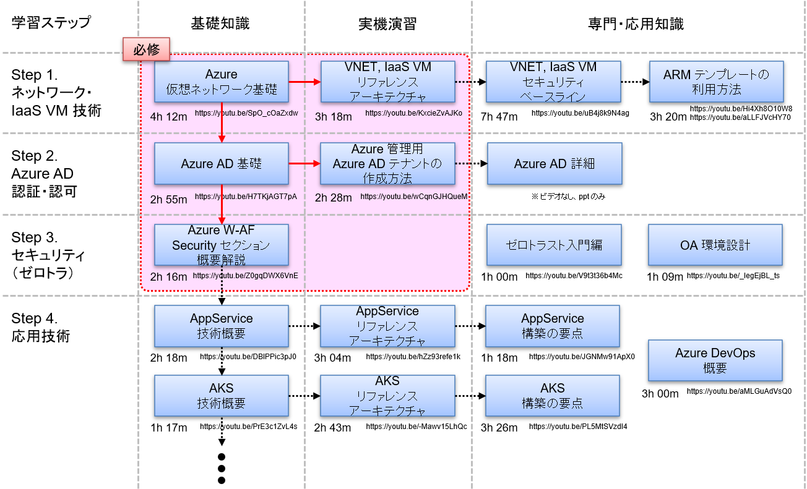
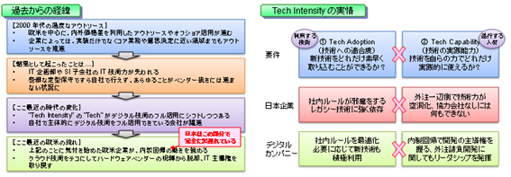
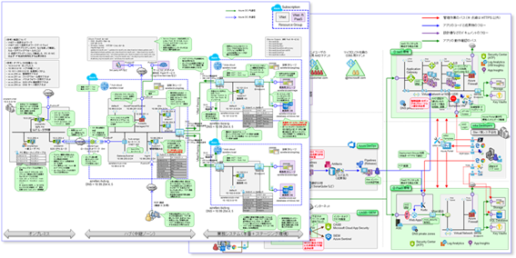
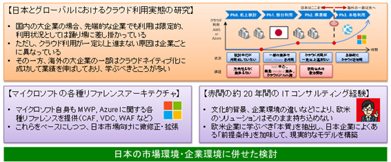

# FgCF (Financial-grade Cloud Fundamentals) コンテンツインデックス

as of 2020/10/23

- zip ファイルのパスワードはすべて "mskk" です。
- 各資料は、作成時点の Azure の仕様に基づいて作成されています。最新版では異なる場合がありますのでご注意ください。
- リンクが張られていないものは、開発予定 or 開発中のものです。

## FgCF について
そもそも FgCF とは何か？ に関するご紹介は、本ページの後ろのほうにあります。下記リンクでジャンプしてご確認ください。
- [Web 記事](#FgCFのご紹介)

## Azure 学習に FgCF を利用する場合の使い方

コンテンツが多くなってきたため、オススメ学習順序を作成しました。本来であればゼロトラスト型マルチクラウド IT 環境の設計技法から学習していくべきところですが、FgCF のコンテンツを使って手っ取り早く Azure を習得したい、という方は以下の学習フローがオススメです。

## FgCF 全体概要
- FgCF 全体概要解説 ([ppt](https://nakama.blob.core.windows.net/mskk/2020_11_25_FgCF_Overview_v0.02_ppt.zip), [video](https://nakama.blob.core.windows.net/mskk/2020_11_25_FgCF_Overview_v0.02.zip), [YouTube](https://youtu.be/mTVgSGGt8NE))

## ① IT 環境
- ゼロトラスト型マルチクラウド IT 環境
  - ゼロトラスト入門編 ([Web記事](https://nakama.azurewebsites.net/?p=65), [ppt](https://nakama.blob.core.windows.net/mskk/2020_03_10_FgCF_ZeroTrustMultiCloudITEnvironment_ppt_v0.40a.zip), [video](https://nakama.blob.core.windows.net/mskk/2020_03_10_FgCF_ZeroTrustMultiCloudITEnvironment_movie_v0.40a.zip), [YouTube](https://www.youtube.com/watch?v=V9t3t36b4Mc)) **★★★ 超重要！**</a>
  - OA 環境設計 ([ppt](https://nakama.blob.core.windows.net/mskk/2020_08_25_FgCF_ZeroTrustITInfraDesign_ppt_v0.17.zip), [video](https://nakama.blob.core.windows.net/mskk/2020_08_25_FgCF_ZeroTrustITInfraDesign_v0.17.zip), [YouTube](https://youtu.be/_IegEjBL_ts))
  - Azure Well-Architected Framework : Security セクション概要解説 ([ppt, video](https://nakama.blob.core.windows.net/mskk/2020_06_12_AzureW-AF_Security_v0.13.zip), [YouTube](https://youtu.be/Z0gqDWX6VnE)) **★★★ 超重要！**</a>
- Azure による仮想データセンタ構築手法
  - 共通技術
    - VDC 構築の進め方の全体像 ([ppt](https://nakama.blob.core.windows.net/mskk/2020_02_05_FgCF_AzureVDC_ProjectPlanOverview_v0.04.zip))
    - ネットワーク基盤の構成方法
      - Azure 仮想ネットワーク基礎 ([ppt](https://nakama.blob.core.windows.net/mskk/2020_10_29_FgCF_AzureNetworkBasis_v0.35_ppt.zip), [video](https://nakama.blob.core.windows.net/mskk/2020_10_29_FgCF_AzureNetworkBasis_v0.35.zip), [YouTube](https://youtu.be/SpO_cOaZxdw)) **★★ 重要**</a>
      - ARM テンプレートの利用方法 ([ppt, video](https://nakama.blob.core.windows.net/mskk/2019_01_03_PracticalARMTemplate.zip), YouTube [前半](https://youtu.be/Hi4Xh8O10W8), [後半](https://youtu.be/aLLFJVcHY70)) **★★ 重要**</a>
    - 認証基盤の構成方法
      - Azure AD 基礎 ([ppt, video](https://nakama.blob.core.windows.net/mskk/2020_01_08_FgCF_AzureADForAzureBasics_v0.22.zip), [YouTube](https://www.youtube.com/watch?v=H7TKjAGT7pA))**★★ 重要**</a>
      - Azure AD 詳細 ([ppt](https://nakama.blob.core.windows.net/mskk/2019_04_18_AzureAuthorizationDesignAndManagement_v0.67.zip))
      - Azure 管理用 Azure AD テナントの作成方法 ([ppt, video](https://nakama.blob.core.windows.net/mskk/2020_10_10_AzureAADforAzure_v0.01.zip), [YouTube](https://youtu.be/wCqnGJHQueM))
  - IaaS の構成方法
    - VNET, IaaS VM セキュリティベースライン ([ppt, video](https://nakama.blob.core.windows.net/mskk/2020_01_17_FgCF_SecurityBaseline(IaaS)_v1.00_SplitVersion.zip), [YouTube](https://youtu.be/uB4j8k9N4ag)) **★ オススメ**</a>
    - リファレンスアーキテクチャ（延伸 VNET 版）と構築の要点 ([ppt, video](https://nakama.blob.core.windows.net/mskk/2019_11_07_FgCF_WebDB_ReferenceArchitecture(IaaSVM).zip), [YouTube](https://youtu.be/KxcieZvAJKo)) **★★ 重要**</a>
    - リファレンスアーキテクチャ（隔離 VNET 版）と構築の要点 ([ppt](https://nakama.blob.core.windows.net/mskk/2020_12_22_FgCF_IaaS_IsolatedVNET_ReferenceArchitecture_v0.01_ppt.zip), [video](https://nakama.blob.core.windows.net/mskk/2020_12_22_FgCF_IaaS_IsolatedVNET_ReferenceArchitecture_v0.01_movie.zip), [YouTube](https://youtu.be/nX4JZNXTjz4)) **★★ 重要**</a>
  - PaaS の構成方法
    - 入門 コンテナ技術 ([ppt](https://nakama.blob.core.windows.net/mskk/2020_07_30_DockerKubernetesBasics_v0.03_ppt.zip), [video](https://nakama.blob.core.windows.net/mskk/2020_07_30_DockerKubernetesBasics_v0.03_video.zip), [YouTube](https://youtu.be/9qFnTc382Ew)) ※ こちらはコンテナ技術 (Docker, Kubernetes など) を知らない方向けの入門コンテンツです。下記の PaaS コンテンツを見る前の基礎知識習得用にご利用ください。
    - App Service (Web App), SQL Database
      - 技術概要 ([ppt](https://nakama.blob.core.windows.net/mskk/2020_06_16_AppService_TechnicalReference_v0.06.zip), [video #1](https://nakama.blob.core.windows.net/mskk/2020_06_16_AppService_TechnicalReference_Part1.zip), [YouTube #1](https://youtu.be/DBlPPic3pJ0))
      - 構築の要点 ([ppt](https://nakama.blob.core.windows.net/mskk/2020_06_16_AppService_TechnicalReference_v0.06.zip), [video #2](https://nakama.blob.core.windows.net/mskk/2020_06_16_AppService_TechnicalReference_Part2.zip), [YouTube #2](https://youtu.be/JGNMw91ApX0))
      - リファレンスアーキテクチャ ([ppt](https://nakama.blob.core.windows.net/mskk/2020_06_16_AppService_TechnicalReference_v0.06.zip), [video #3](https://nakama.blob.core.windows.net/mskk/2020_06_16_AppService_TechnicalReference_Part3.zip), [YouTube #3](https://youtu.be/hZz93refe1k))
    - AKS (Azure Kubernetes Services)
      - 技術概要 ([ppt](https://nakama.blob.core.windows.net/mskk/2020_04_25_AKS_TechnicalReference_v0.14(ppt).zip), [video #1](https://nakama.blob.core.windows.net/mskk/2020_04_25_AKS_TechnicalReference_v0.14(video1).zip), [YouTube #1](https://youtu.be/PrE3c1ZvL4s))
      - 構築の要点 ([video #2](https://nakama.blob.core.windows.net/mskk/2020_04_25_AKS_TechnicalReference_v0.14(video2).zip), [YouTube #2](https://youtu.be/PL5MtSVzdI4))
      - リファレンスアーキテクチャ ([video #3](https://nakama.blob.core.windows.net/mskk/2020_04_25_AKS_TechnicalReference_v0.14(video3).zip), [YouTube #3](https://youtu.be/-Mawv15LhQc))

    - ARO (Azure Red Hat OpenShift)
      - 技術概要、構築の要点 ([ppt](https://nakama.blob.core.windows.net/mskk/2020_10_20_AROTechReference_v0.14.zip))
      - リファレンスアーキテクチャ、構築スクリプト ([ppt](https://nakama.blob.core.windows.net/mskk/2020_10_20_AROTechReference_v0.14.zip))
      - ※ ARO リファレンスアーキテクチャは Red Hat 様ご協力の元、HPE 惣道様・米倉様に開発いただきました。この場を借りてお礼申し上げます。m(_ _)m

    - Azure Batch
      - 技術概要 ([ppt](https://nakama.blob.core.windows.net/mskk/2019_05_21_AzureBatchSample_Materials.zip), [video](https://nakama.blob.core.windows.net/mskk/2019_05_21_AzureBatchSample_Video.zip), [YouTube #1](https://www.youtube.com/watch?v=-cJ50AfA8B4&t=2675s))
      - 設計・実装技法 ([ppt](https://nakama.blob.core.windows.net/mskk/2020_08_14_AzureBatch_TechnicalReference_ppt_v0.20.zip), [video](https://nakama.blob.core.windows.net/mskk/2020_08_14_AzureBatch_TechnicalReference_v0.20.zip), [YouTube #2](https://youtu.be/o7AX2sP5TyE))
      - リファレンスアーキテクチャ
  - DevOps の構成方法
    - Azure DevOps 概要デモ ([ppt, video](https://nakama.blob.core.windows.net/mskk/2020_02_26_AzureDevOps_OverviewAndDemo_v0.02.zip), [YouTube](https://www.youtube.com/watch?v=aMLGuAdVsQ0&t=6045s)) **★ オススメ**</a>
    - 権限分掌 作業ワークフローモデル
  - DaaS の構成方法
    - WVD 技術リファレンス ([ppt](https://nakama.blob.core.windows.net/mskk/2020_01_06_WVDTechReference_v0.19.zip), [YouTube](https://www.youtube.com/watch?v=Ac6ZfZFwwIo))

## ② ルール・ガバナンス

- ルール・ガバナンス再設計ガイド
- セキュリティ維持・監査ガイド
- SaaS セキュリティ審査ガイド

## ③ 人材育成
- 人材育成計画策定ガイド

# FgCFのご紹介

## はじめに ～ FgCF を開発した背景 ～
 
現在、全世界の様々な企業がデジタル変革（DX, Digital Transformation）を目指して様々な取り組みを始めており、様々な成功事例も聞かれるようになってきました。こうした中、海外や国内で成功しているデジタルカンパニーに目を向けてみると、

-	適切な技術回帰により自社の Tech Intensity （技術を自ら実践的に使いこなす力）を高める
-	競争領域に関しては、内製型アジャイル開発にシフトして、継続的に企業競争力を強化する
-	非競争領域に関しては、アウトソースを活用しながらも、開発の主導権は自社できちんと握って適切な開発を進める
 
といった取り組みが多く見受けられるようになってきました。
 
この流れを強く加速することになった大きな原因のひとつが、ここ 10 年で大きく進んだ、様々なクラウドサービス（SaaS, PaaS, IaaS）の登場です。エンドユーザ企業がハードウェアや基盤を容易に調達できるようになった結果、従来、ハードウェアメーカー主導で進めざるを得なかった IT サービスの企画・検討・開発を、ユーザ企業主導で進めていくことができる環境が整いました。日本でも、多くの企業が、多種多様なクラウドサービス（Microsoft 365, SFDC, Slack, Zoom, AWS, GCP, Azure など）をいかに上手くマルチに活用し、自社 IT をどのように改善・強化するかを考えるようになってきています。

しかしこの恩恵に預かるためには、『自社の中に Tech Intensity （技術を自ら実践的に使いこなす能力と人材）を持つこと』が必須要件になります。日本の大企業に目を向けてみると、2000 年頃より始まったアウトソースを過度に進めすぎたが故に、デジタル変革を推進していくための「底力」を失ってしまっているケースが少なくありません。その中でも特に大きな課題として考えられるのが以下の 3 つです。
 
1. 閉鎖的な IT 環境 : 境界セキュリティを前提とした IT 環境
1. 新技術導入がしにくい社内ルール : 最新技術の積極活用を拒む過度なルール
1. IT 人材の技術力不足 : 最新技術を利活用できない・手を動かせないレガシー人材の増加

## FgCF の目指すもの
 
こうした流れを踏まえると、日本企業がデジタル変革へ取り組んでいくためには、その基盤として改めて①～③の改善に取り組み、自社の Tech Intensity（テクノロジー強度）を強く改善・強化していく必要があります。FgCF （Financial-grade Cloud Fundamentals）は、この取り組みを推進することを目的として生まれました。

この FgCF は、様々な各種のハイレベルなリファレンスアーキテクチャやテクノロジガイドライン類を、日本のお客様に使いやすい・わかりやすい形で提供することを目的として開発されています。これは以下の理由によります。
 
- 米国マイクロソフト本社からは以下のような各種のガイドライン類やドキュメント類が提供されている。
  - CAF （Cloud Adoption Framework）
  - Azure VDC （Azure Virtual Data Center）
  - Azure WAF （Azure Well-Architected Framework）
  - 製品ドキュメント（docs.microsoft.com）
  - Microsoft Learn
- しかしこれらはドキュメント量が膨大、かつ英語圏特有の「読みづらさ」があり、初学者がとっつきづらい
 
FgCF では最初に覚えるべき設計セオリーを、日本語で端的に学べるように整備することで、①～③を素早く理解・整備していけるようにすることを目指しています。

※ （参考） FgCF は "Financial" と銘打ってはいるものの、考え方やリファレンスそのものは金融業界に留まらず利用できるものです。公共系、製造系など、セキュリティに対して特に高い要件を有する業界・業種であっても問題なく利用できる、という意味合いで "Financial-grade" という名称をつけています。
 
## FgCF の資料の歩き方
 
FgCF では、（今後の IT 環境のあるべき姿としての）ゼロトラスト型 IT 環境をベースに置いた考え方を採用しており、様々なリファレンスアーキテクチャもこれを念頭に置いた設計を行っています。しかし、「ゼロトラスト」に関しては用語の定義が人によって異なることから、以下の順序で FgCF 関連資料をご確認いただければと思います。

- すべての利用者
  - まず「ゼロトラスト型マルチクラウド IT 環境入門」を確認する
  - さらに、共通技術として以下を学習する
    - VDC 構築の進め方の全体像
    - ネットワーク基盤の構築方法（VNET, ARM テンプレート）
    - 認証基盤の構築方法（Azure AD）
- IT インフラエンジニアの方々
  - IaaS の構成方法
  - DaaS の構成方法
- 開発エンジニアの方々
  - PaaS の構成方法
  - DevOps の構成方法

また関連して、xDM（意思決定者）の方々向けにはルール・ガバナンスに関する資料や人材育成に関する資料をご確認ください（これらの資料は今後、随時公開予定です）。
 
## Special Thanks
 
FgCF の開発にあたっては、マイクロソフト社内外のエンジニア・アーキテクトの皆様から多大なご協力を頂きました。改めて御礼申し上げます。今後とも引き続き、日本の Tech Intensity 強化のため、ご一緒できれば幸いです。

 
2020/06/08 
FgCF 開発リード テクニカルアーキテクト 
日本マイクロソフト株式会社 金融統括営業本部 
インダストリーテクノロジーストラテジスト 
赤間 信幸

